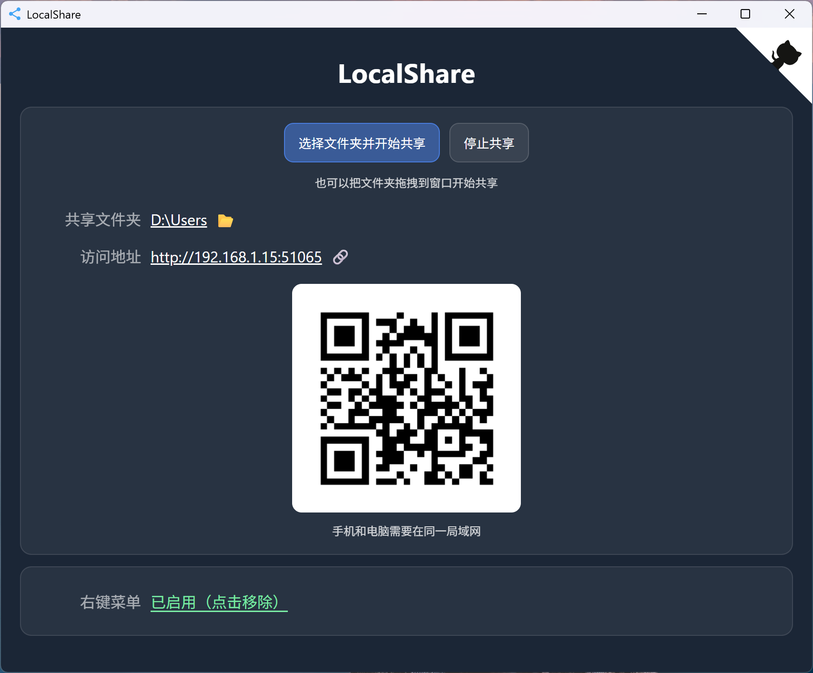

# LocalShare（local-share-golang）

一个基于 Go + Wails 的局域网文件夹共享工具：选择一个本地文件夹后，会在本机启动一个 HTTP 服务，并提供可在手机/电脑浏览器打开的网页界面用于浏览、下载、预览与上传。

本项目为**纯绿色应用（免安装/便携版）**：下载/解压后即可运行，不依赖系统服务。可选功能（Windows 资源管理器右键菜单）会写入当前用户注册表（HKCU），无需管理员权限，可随时在应用内关闭。

## preview

## 主要功能

- 共享本机任意文件夹到局域网：生成访问地址（形如 `http://<本机IP>:<端口>`）
- 生成二维码：手机扫码即可打开共享页面
- 网页端文件管理：目录浏览、文件下载、文件预览（按浏览器支持的类型）、文件上传
- Windows 集成：可选启用“右键共享此文件夹”（对文件夹与文件夹空白处生效）

## 使用方法（普通用户）

1. 运行程序（Windows 下为 `local-share-golang.exe`）。
2. 在界面中选择要共享的文件夹并启动共享。
3. 使用同一局域网内的设备访问：
   - 直接在浏览器打开界面显示的 URL；或
   - 用手机扫描界面显示的二维码。
4. 在网页中浏览文件并进行下载/预览/上传。
5. 不需要共享时，点击停止共享。

提示：访问设备必须与电脑在同一局域网（同一 Wi-Fi/同网段）。如打不开，优先检查防火墙是否拦截。

## Windows 右键菜单（可选）

启用后，你可以在资源管理器中对文件夹使用右键菜单：

- 在文件夹上右键：选择“共享此文件夹”
- 在文件夹空白处右键：选择“共享此文件夹”（共享当前目录）

应用会以参数方式启动：`--share="<路径>"`。

说明：该功能写入当前用户注册表（HKCU\Software\Classes\...），无需管理员权限；禁用后会清理对应键值。

## 纯绿色应用说明

本项目定位为**纯绿色/免安装**：

- 不需要安装器，不需要写入系统服务
- 程序文件放哪都能运行，删除程序文件夹即可“卸载”
- 唯一可能的系统改动来自“Windows 右键菜单”这一可选功能（仅当前用户范围，且可在应用内关闭并清理）

## 常见问题

### 1) 其他设备打不开 URL

- 确保两台设备在同一局域网
- 检查 Windows 防火墙/安全软件是否拦截该程序的入站访问
- 确认电脑没有同时启用多个网络导致 IP 选择不正确（可尝试切换网络后重新开始共享）

### 2) 端口会变化吗？

首次启动共享会自动选择一个可用端口；在共享服务已运行时，重复“共享”只会切换共享目录，尽量保持端口不变。

### 3) 重复启动程序会怎样？

程序为单实例：如果已有实例在运行，新启动会把 `--share` 指定的目录转发给已运行实例，并唤醒窗口到前台。

## 开发与构建（开发者）

### 依赖

- Go（版本以 `go.mod` 为准）
- Node.js / npm（用于构建前端）
- Wails v2

### 开发模式

- `wails dev`

### 构建发布

- `wails build`

项目配置见 `wails.json`。
